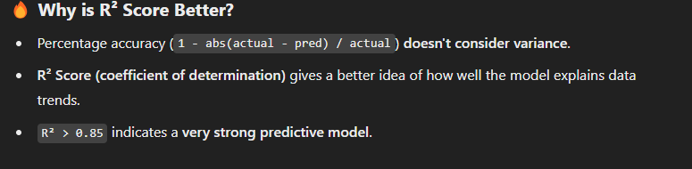

# Border Traffic Congestion Prediction

## Introduction
This project focuses on predicting traffic congestion at border crossings using machine learning models. It utilizes historical traffic data from the Cascade Gateway Border Wait Times Dashboard to forecast traffic delays and volumes at 15-minute intervals. The objective is to improve traffic management, optimize resource allocation, and minimize delays.

---

## Objectives
1. **Data Collection**: Gather historical traffic data from the Cascade Gateway Border Wait Times Dashboard.
2. **Data Preprocessing**: Clean, preprocess, and engineer features to enhance data quality.
3. **Model Development**: Train and evaluate machine learning models (Random Forest, XGBoost, LightGBM, CatBoost, Ridge Stacking).
4. **Feature Engineering**: Integrate rolling averages, holiday indicators, zero-traffic impact, and interaction features.
5. **Model Evaluation**: Assess performance using RMSE and feature importance analysis.
6. **Scalability**: Optimize the pipeline for faster preprocessing and training on large datasets.

---

## Repository Structure
```
BWT/  # Root of the repository

├── docs/
│   ├── code-walkthrough.md        # Code walkthrough documentation
│   ├── data_preprocessing.md       # Data preprocessing documentation
│   ├── diagrams.md               # Documentation of diagrams, perhaps architecture or data flow.
│   ├── model_training.md          # Model training documentation
├── plots/
│   ├── ridge_stacked_delay_comparison.png # Visual comparison of delay predictions
│   ├── ridge_stacked_volume_comparison.png # Visual comparison of volume predictions
│   ├── scoring.png                   # Scoring plot, perhaps model evaluation metrics
├── scripts/
│   ├── preprocess_data.py      # Script for data preprocessing and feature engineering
│   ├── stacked_predict.py      # Script for making predictions using the stacked model
│   ├── stacked_training.py     # Script for training the stacked model
│   ├── train_base_models.py    # Script for training the base models
├── .gitignore
├── README.md
├── requirements.txt
```

---

## Key Components
| Component              | Description                                                            | Documentation Links |
|------------------------|------------------------------------------------------------------------|----------------------|
| **Data Preprocessing** | Cleaning, aggregating, and engineering features from raw traffic data. | [Data Preprocessing](docs/data_preprocessing.md) |
| **Feature Engineering** | Adding rolling averages, zero-traffic indicators, and interaction features. | [Feature Engineering](docs/data_preprocessing.md) |
| **Model Training**  | Training Random Forest, XGBoost, LightGBM, CatBoost, and Ridge Stacking models. | [Model Training](docs/model_training.md) |
| **Evaluation & Feature Importance** | Extracting RMSE scores and analyzing feature contributions. | [Model Training](docs/model_training.md) |

---

## Features Used
- **Time-based Features**: Year, Month, Day, DayOfWeek, Hour, IsWeekend.
- **Rolling Features**: Delay and Volume averages over 3, 6, and 12 hours.
- **Zero Traffic Indicators**: `IsDelayZero`, `IsVolumeZero`, `ZeroDelayImpact`, `ZeroVolumeImpact`.
- **Interaction Features**: `Delay_Hour_Interaction`, `Volume_Hour_Interaction`.
- **Holiday Impact**: `IsHoliday` feature merged from external data.
- **Volume-to-Delay Ratio**: Helps understand congestion intensity.

---

## Steps to Run the Project

### 1. Install Dependencies
```sh
pip install -r requirements.txt
```

### 2. Data Preprocessing
```sh
python scripts/preprocess_data.py
```
- Aggregates raw data into 15-minute intervals.
- Handles missing values, creates engineered features, and saves processed datasets.

### 3. Model Training
```sh
python scripts/train__base_models.py
python scripts/stacked_training.py
```
- Trains multiple models (Random Forest, XGBoost, LightGBM, CatBoost, Ridge Stacking, XGBoost Stacking).
- Saves trained models and feature importance scores.

### 4. Model Evaluation
```sh
python scripts/stacked_prediction.py
```
- Loads trained models and evaluates predictions on test data.
- Saves predictions to the `stacked_predictions/` folder.

---

## Model Performance
| Model         | RMSE (Avg - Delay) | RMSE (Avg - Volume) | Accuracy Delay (%) |  Accuracy Volume (%) | 
|--------------|------------------|------------------|--------------|--------------|
| **Ridge Stacked** | **3.45** | **4.50** | **89.31%** |  **93.63** |
| **Base XGBoost** | 3.31 | 4.31 | 89.34% | 93.35 |
| **Base LightGBM** | 3.55 | 4.67 | 87.79% |  92.20 |
| **Base CatBoost** | 3.42 | 4.41 | 88.65% | 93 |

# Base Models Detailed Accuracies
XGBoost: RMSE Delay = 3.31, Accuracy Delay = 89.34%
XGBoost: RMSE Volume = 4.31, Accuracy Volume = 93.35%

LightGBM: RMSE Delay = 3.55, Accuracy Delay = 87.79%
LightGBM: RMSE Volume = 4.67, Accuracy Volume = 92.20%

CatBoost: RMSE Delay = 3.42, Accuracy Delay = 88.65%
CatBoost: RMSE Volume = 4.41, Accuracy Volume = 93%.

---
# Diagrams
[Diagrams](docs/diagrams.md)
---

## **Deployment on Google Cloud**
To scale and automate the pipeline, we have deployed the entire ML workflow on **Google Cloud Platform (GCP)**. This allows for efficient storage, training, and inference using **Google Cloud Storage (GCS) and Vertex AI**.

### **GCP Architecture**
- **Google Cloud Storage (GCS) Buckets**  
  - `gs://bwt-project-data/raw_data/` → Stores raw traffic data.  
  - `gs://bwt-project-data/processed_data/` → Stores preprocessed data.  
  - `gs://bwt-project-data/base_models/` → Stores trained base models.  
  - `gs://bwt-project-data/stacked_models/` → Stores Ridge stacked models.  
  - `gs://bwt-project-data/stacked_predictions/` → Stores final predictions.  

- **Vertex AI Workbench**  
  - Used for training base models and Ridge Stacking models.  
  - Optimized training scripts to load/save data directly from GCS for efficient computation.  

- **Next Step: Model Deployment**  
  - Deploy trained Ridge Stacked model via **Vertex AI Endpoint** or **Google Cloud Functions** for real-time predictions.  

---

## **Optimization & Scalability**
- ✅ **Faster Preprocessing**: Uses optimized Pandas operations and parallelization where applicable.
- ✅ **Feature Selection**: Focus on informative features to improve model interpretability.
- ✅ **Hyperparameter Tuning**: Uses Optuna for automated tuning of XGBoost Stacking.
- ✅ **Deployment on Google Cloud**: The entire workflow is deployed on **Google Cloud**, ensuring efficient processing, storage, and inference.
